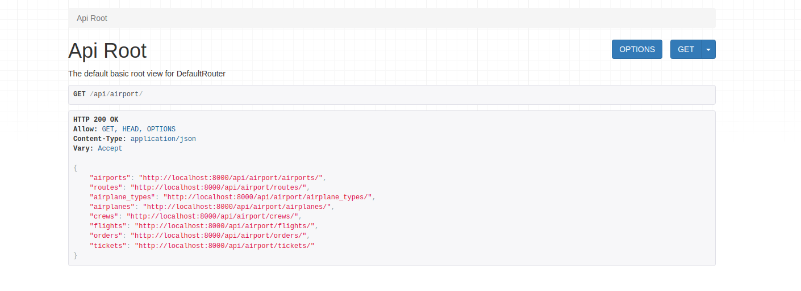
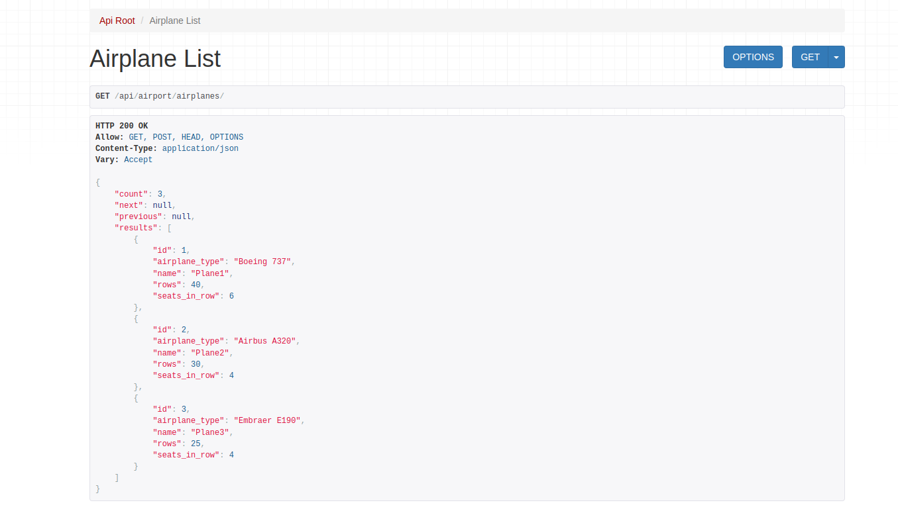
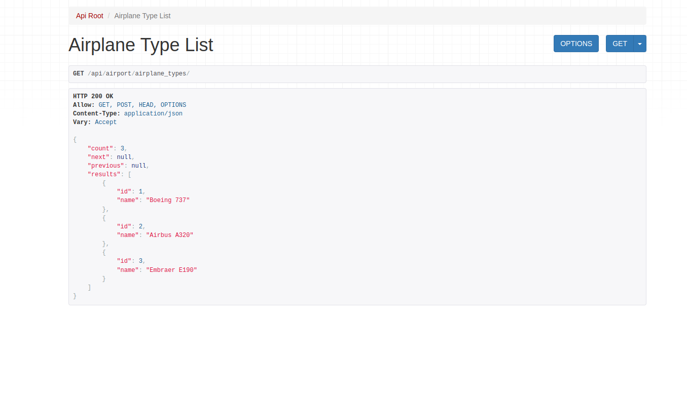
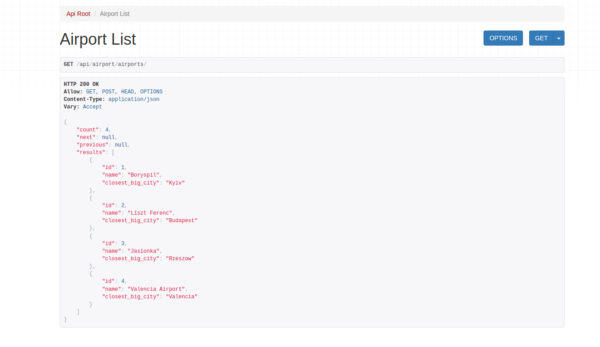
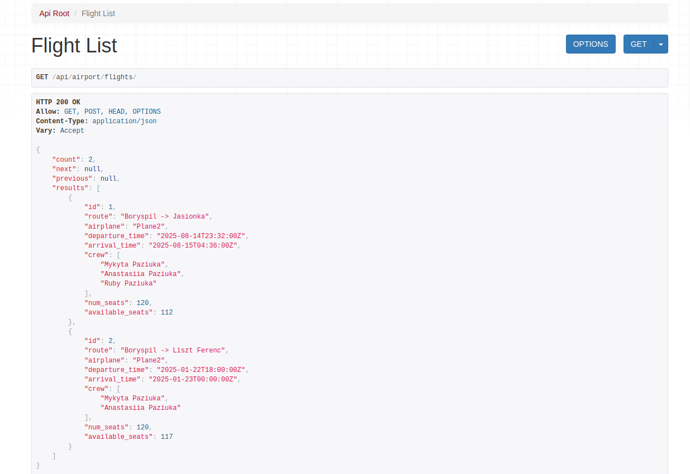
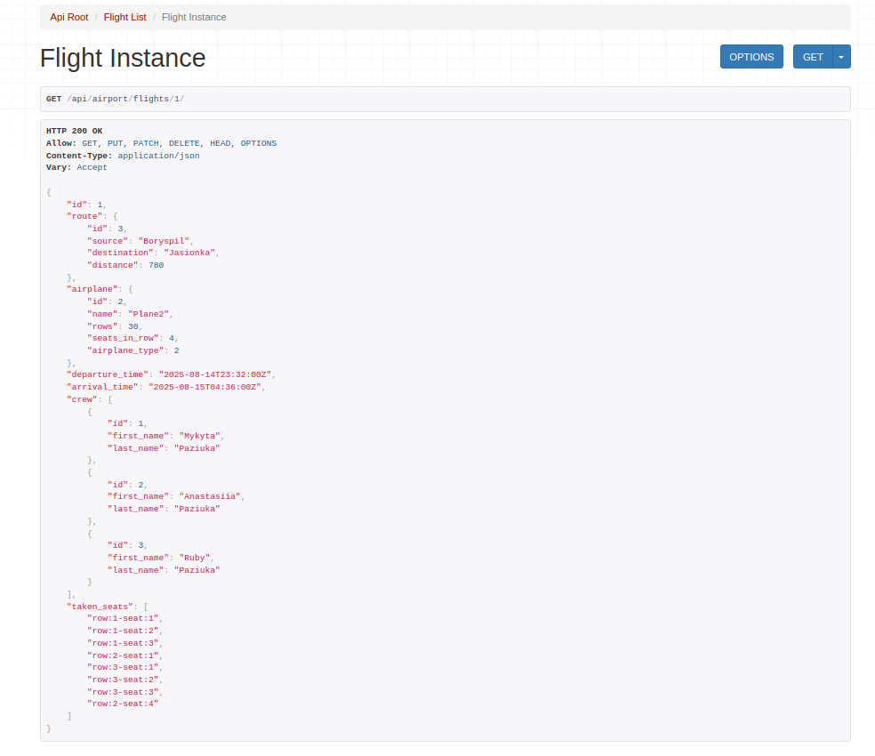
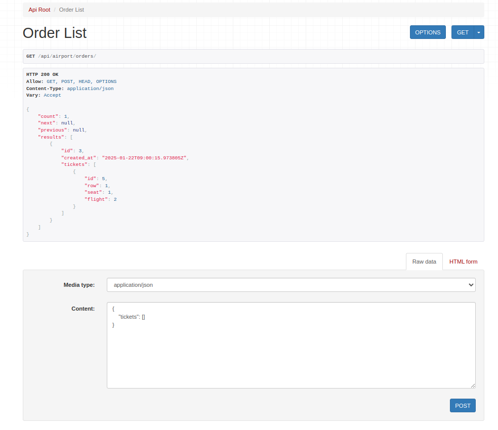
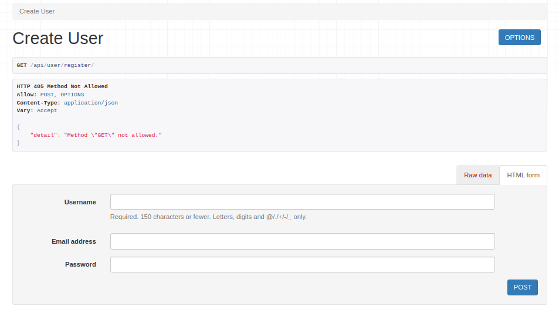
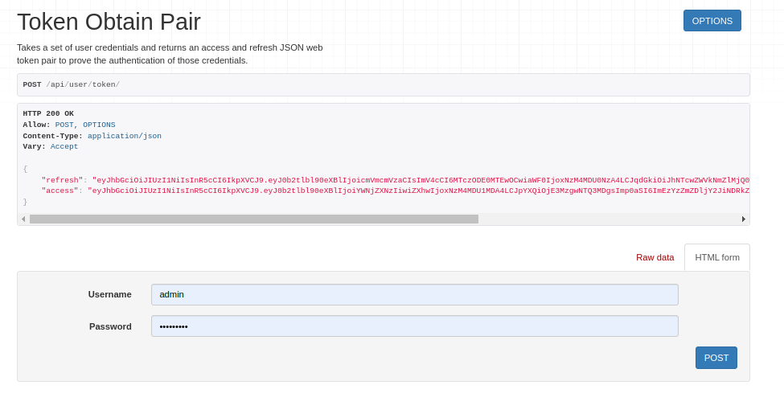

# AirportAPI

AirportAPI is a REST API service designed for managing airport-related data, including flights, routes, airplanes, crews, and user orders. It provides a robust and scalable solution for handling airport operations, with features like JWT authentication, pagination, filtering, and automatic API documentation using Swagger.

## Features

- **User Management**: Registration, authentication, and role-based access control.
- **Flight Management**: Create, update, and retrieve flight information.
- **Route Management**: Manage routes between airports.
- **Airplane Management**: Handle airplane types and details.
- **Order Management**: Users can create and manage their orders for flight tickets.
- **JWT Authentication**: Secure authentication using JSON Web Tokens.
- **Swagger Documentation**: Automatic API documentation for easy integration.

## Technologies

- **Django**: A high-level Python web framework.
- **Django REST Framework**: For building RESTful APIs.
- **SQLite**: Default database for development.
- **JWT (JSON Web Tokens)**: For secure user authentication.
- **drf-spectacular**: For generating Swagger/OpenAPI documentation.

## Installation

1. Clone the repository:
   ```bash
   git clone https://github.com/A-n-a-s-t-a-s-i-i-a/api-airport.git
   cd api-airport
   
2. Install the dependencies:
    ```bash
    pip install -r requirements.txt

3. Apply migrations:
    ```bash
   python manage.py migrate

4. Run the server:
    ```bash
   python manage.py runserver

5. The API will be available at: http://127.0.0.1:8000/

## Usage

After starting the server, you can access the Swagger documentation at: [http://127.0.0.1:8000/api/schema/swagger-ui/](http://127.0.0.1:8000/api/schema/swagger-ui/)

### Example Requests

#### Register a new user:
```bash
curl -X POST http://127.0.0.1:8000/api/user/register/ \
     -d '{"username": "user", "password": "password", "email": "user@example.com"}'
```

#### Get a JWT token:
```bash
curl -X POST http://127.0.0.1:8000/api/user/token/ \
     -d '{"username": "user", "password": "password"}'
```

#### List all flights:
```bash
curl -X GET http://127.0.0.1:8000/api/airport/flights/ \
     -H "Authorization: Bearer <your_jwt_token>"
```


## API Endpoints

### Airport
- **GET /api/airport/airports/**: Retrieve a list of all airports.
- **GET /api/airport/airports/{id}/**: Retrieve details of a specific airport.
- **POST /api/airport/airports/**: Create a new airport (Admin only).
- **PUT /api/airport/airports/{id}/**: Update an existing airport (Admin only).
- **DELETE /api/airport/airports/{id}/**: Delete an airport (Admin only).

### Route
- **GET /api/airport/routes/**: Retrieve a list of all routes.
- **GET /api/airport/routes/{id}/**: Retrieve details of a specific route.
- **POST /api/airport/routes/**: Create a new route (Admin only).
- **PUT /api/airport/routes/{id}/**: Update an existing route (Admin only).
- **DELETE /api/airport/routes/{id}/**: Delete a route (Admin only).

### Airplane Type
- **GET /api/airport/airplane_types/**: Retrieve a list of all airplane types.
- **GET /api/airport/airplane_types/{id}/**: Retrieve details of a specific airplane type.
- **POST /api/airport/airplane_types/**: Create a new airplane type (Admin only).
- **PUT /api/airport/airplane_types/{id}/**: Update an existing airplane type (Admin only).
- **DELETE /api/airport/airplane_types/{id}/**: Delete an airplane type (Admin only).

### Airplane
- **GET /api/airport/airplanes/**: Retrieve a list of all airplanes.
- **GET /api/airport/airplanes/{id}/**: Retrieve details of a specific airplane.
- **POST /api/airport/airplanes/**: Create a new airplane (Admin only).
- **PUT /api/airport/airplanes/{id}/**: Update an existing airplane (Admin only).
- **DELETE /api/airport/airplanes/{id}/**: Delete an airplane (Admin only).

### Crew
- **GET /api/airport/crews/**: Retrieve a list of all crew members.
- **GET /api/airport/crews/{id}/**: Retrieve details of a specific crew member.
- **POST /api/airport/crews/**: Create a new crew member (Admin only).
- **PUT /api/airport/crews/{id}/**: Update an existing crew member (Admin only).
- **DELETE /api/airport/crews/{id}/**: Delete a crew member (Admin only).

### Flight
- **GET /api/airport/flights/**: Retrieve a list of all flights.
- **GET /api/airport/flights/{id}/**: Retrieve details of a specific flight.
- **POST /api/airport/flights/**: Create a new flight (Admin only).
- **PUT /api/airport/flights/{id}/**: Update an existing flight (Admin only).
- **DELETE /api/airport/flights/{id}/**: Delete a flight (Admin only).

### Order
- **GET /api/airport/orders/**: Retrieve a list of all orders (Authenticated users can only see their own orders).
- **GET /api/airport/orders/{id}/**: Retrieve details of a specific order.
- **POST /api/airport/orders/**: Create a new order (Authenticated users only).
- **DELETE /api/airport/orders/{id}/**: Delete an order (Admin only).

### Ticket
- **GET /api/airport/tickets/**: Retrieve a list of all tickets (Admin only).
- **GET /api/airport/tickets/{id}/**: Retrieve details of a specific ticket (Admin only).
- **DELETE /api/airport/tickets/{id}/**: Delete a ticket (Admin only).


## Permissions

- **Admin Users**: Full access to all endpoints.
- **Authenticated Users**: Read-only access to most endpoints.
- **Unauthenticated Users**: Access to registration and token endpoints only.


## API Endpoints Preview









